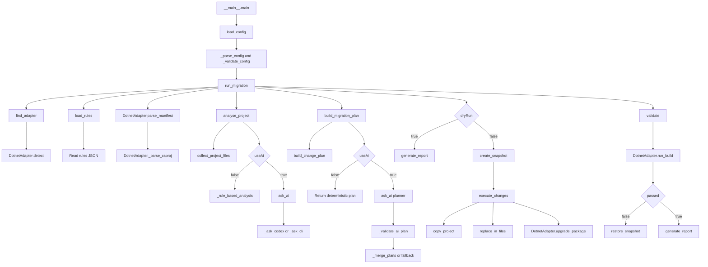

# AI Migration Agent

Adapter-based migration tool for structural project upgrades.

The current supported migration is `.NET 6` to `.NET 8`. The agent reads a target project, builds a migration plan from checked-in rules and project manifests, copies the project to `outputPath`, applies framework/package changes to the copy, validates with `dotnet build`, and writes a markdown report.

The agent does not intentionally modify business logic or source code files. Migration steps that require API replacements, method changes, class refactoring, or logic updates are ignored.

## Project Start Commands

From this repository:

```powershell
cd D:\Projects\AI\ai-migration-agent
python -m venv .venv
.\.venv\Scripts\Activate.ps1
pip install -e .
Copy-Item migrate.config.example.json migrate.config.json
```

Edit `migrate.config.json`, then run:

```powershell
python -m migration_agent --config migrate.config.json
```

Optional test setup:

```powershell
pip install -e ".[dev]"
pytest
```

The package also exposes this console command after installation:

```powershell
migration-agent --config migrate.config.json
```

## Current Business Logic

The current business logic is mostly rule-based structural migration. It is not analysing source files deeply and upgrading code itself.

What it actually does:

- Reads `migrate.config.json`.
- Detects the runtime adapter, currently `.NET`.
- Loads migration rules from `migration_agent/rules/dotnet/6-to-8.json`.
- Parses `.csproj` files to identify target frameworks and package references.
- Collects structural project/config files for optional AI analysis.
- Builds an executable plan containing only:
  - framework changes, currently `net6.0` to `net8.0`
  - package upgrades listed in the rules file
- Copies the original project to `outputPath`.
- Applies changes only on the copied project.
- Runs `dotnet build` on the copied project.
- Writes `migration-report.md`.

What it does not do:

- It does not transform `.cs` business logic.
- It does not replace deprecated APIs in code.
- It does not refactor classes, methods, services, controllers, jobs, or domain logic.
- It does not automatically create new migration rules from source-code analysis.

So the answer is: we are mainly reading the rules file and the project manifest, then applying deterministic structural upgrades. Optional AI is used only to analyse structural files and propose a plan, but the plan is validated against local rules before execution.

## 80 Percent Rule

There is no execution threshold where AI must be 80 percent confident.

The only current `80` is in `migration_agent/core/analyser.py` inside `_rule_based_analysis()`. It sets:

```python
"confidence": 80
```

That value is report metadata only. It appears in `migration-report.md` through `generate_report()` in `migration_agent/core/reporter.py`. It does not decide whether changes run. Execution is controlled by `dryRun`, `autoApprove`, and whether a valid plan exists.

## AI Mode

AI support is now CLI-only. There is no API-key-based implementation.

Config example:

```json
{
  "useAi": true,
  "aiProvider": "codex",
  "aiMode": "cli"
}
```

CLI mode uses your locally authenticated `codex` or `claude` command. The tool sends the prompt through stdin and expects valid JSON back.

For Codex, the default command is:

```powershell
codex exec --skip-git-repo-check -
```

On Windows, if PowerShell resolves `codex` incorrectly, set `aiCliCommand` explicitly:

```json
{
  "useAi": true,
  "aiProvider": "codex",
  "aiMode": "cli",
  "aiCliCommand": [
    "C:\\Users\\YOUR_USER\\AppData\\Roaming\\npm\\codex.cmd",
    "exec",
    "--skip-git-repo-check"
  ]
}
```

Rule-only mode:

```json
{
  "useAi": false
}
```

## Application Flow



## File Responsibilities and Links

`migration_agent/__main__.py`

- Entry point for `python -m migration_agent`.
- `main()` calls `load_config()` from `migration_agent/cli/args.py`.
- `main()` then calls `run_migration()` from `migration_agent/core/agent.py`.
- This file links CLI startup to the orchestration layer.

`migration_agent/cli/args.py`

- Defines `RuntimeSpec` and `MigrationConfig`.
- `load_config()` reads the JSON config path from `--config`.
- `_parse_config()` converts JSON into typed config objects.
- `_parse_ai_config()` builds `AiConfig` from `migration_agent/ai/provider.py`.
- `_validate_config()` checks paths, runtime compatibility, retry count, and AI provider/mode.
- `_ask_ai_provider()` is triggered only when `useAi` is true but no provider is configured.

`migration_agent/core/agent.py`

- Main orchestration file.
- `run_migration()` links almost every major module:
  - calls `find_adapter()` from `migration_agent/adapters/__init__.py`
  - calls `load_rules()` in the same file
  - calls `adapter.parse_manifest()`
  - calls `analyse_project()`
  - calls `build_migration_plan()`
  - calls `create_snapshot()`
  - calls `execute_changes()`
  - calls `validate()`
  - calls `restore_snapshot()` on validation failure
  - calls `generate_report()`
- This function is the business workflow trigger.

`migration_agent/adapters/__init__.py`

- Registers available adapters in `ADAPTERS`.
- `find_adapter()` loops through adapters and calls each adapter's `detect()` function.
- Currently links runtime `"dotnet"` to `DotnetAdapter`.

`migration_agent/adapters/base.py`

- Defines the adapter interface.
- `BaseAdapter` requires `detect()`, `parse_manifest()`, `upgrade_package()`, and `run_build()`.
- This file is architectural contract code, not business logic by itself.

`migration_agent/adapters/dotnet.py`

- Implements `.NET` project support.
- `DotnetAdapter.detect()` finds `.csproj` or `.sln`.
- `DotnetAdapter.parse_manifest()` scans `.csproj` files.
- `DotnetAdapter._parse_csproj()` reads target frameworks and package references.
- `DotnetAdapter.upgrade_package()` updates matching `PackageReference` versions.
- `DotnetAdapter.run_build()` runs `dotnet build`.
- `_replace_package_version()` is direct execution logic for package upgrades.
- `_shutdown_build_server()` cleans up .NET build servers after validation.

`migration_agent/core/analyser.py`

- Creates the project analysis object.
- `analyse_project()` always calls `collect_project_files()`.
- If `useAi` is true, it calls `ask_ai()` from `migration_agent/ai/provider.py`.
- If AI is disabled or returns no result, it calls `_rule_based_analysis()`.
- `_rule_based_analysis()` checks manifest target frameworks against `rules["targetFrameworkChange"]`.
- `_normalize_analysis()` fills default report fields.
- This file directly affects business logic because it decides what findings exist before planning.

`migration_agent/core/planner.py`

- Converts analysis and rules into executable plan items.
- `build_migration_plan()` first calls `build_change_plan()` to create deterministic fallback.
- If AI is enabled, it calls `ask_ai()` and then `_validate_ai_plan()`.
- `_validate_framework_change()` allows only rule-matching framework changes on structural files.
- `_validate_package_change()` allows only packages listed in the rules file and present in the manifest when manifest package data exists.
- `_merge_plans()` combines valid AI plan items with deterministic fallback and removes duplicates.
- This file directly affects business logic because it decides exactly which changes can execute.

`migration_agent/core/executor.py`

- Applies plan items to a copied project.
- `execute_changes()` calls `copy_project()` first.
- For `framework` changes it calls `replace_in_files()`.
- For `package` changes it calls `adapter.upgrade_package()`.
- `copy_project()` excludes `bin`, `obj`, `.git`, and `.vs`.
- This file directly affects output files.

`migration_agent/core/validator.py`

- `validate()` calls `adapter.run_build()`.
- It converts build output into a passed/failed validation result.

`migration_agent/core/rollback.py`

- `create_snapshot()` copies the original project to a rollback folder before execution.
- `restore_snapshot()` replaces the output folder with the snapshot if validation fails.
- `_remove_tree_with_retry()` and `_copy_tree_with_retry()` handle Windows file-lock retries.

`migration_agent/core/reporter.py`

- `generate_report()` builds `migration-report.md`.
- It summarizes planned changes, applied changes, files changed, findings, validation output, and rollback errors.
- `_format_result()`, `_format_finding()`, `_format_planning_notes()`, and `_format_rollback_error()` format report sections.

`migration_agent/ai/provider.py`

- Holds AI provider config and CLI execution.
- `ask_ai()` checks `use_ai` and dispatches to Codex or Claude.
- `_ask_codex()` currently calls `_ask_cli()`.
- `_ask_cli()` runs the configured/default CLI command and parses JSON output.
- `_default_cli_command()` resolves `codex` or `claude`.
- `_parse_json_object()` extracts JSON from CLI output.

`migration_agent/ai/codex.py`

- Backward-compatible wrapper.
- `ask_codex()` simply calls `ask_ai()` with Codex CLI config.
- This is currently redundant because the main application calls `ask_ai()` directly.

`migration_agent/rules/dotnet/6-to-8.json`

- Migration rule source for `.NET 6` to `.NET 8`.
- Contains:
  - `targetFrameworkChange`: `net6.0` to `net8.0`
  - allowed package upgrades
  - deprecated API notes
  - config change notes
- Only `targetFrameworkChange` and `packageChanges` currently drive executable changes.
- `deprecatedApis` and `configChanges` are informational right now.

`tests/test_planner.py`

- Tests planner behavior.
- Verifies source-code findings do not become source-code edits.
- Verifies packages missing from manifest are filtered out.
- Verifies valid AI plans are accepted.
- Verifies unsafe AI plans fall back to deterministic rules.

## Redundant or Low-Value Pieces

- `migration_agent/ai/codex.py` is redundant as a compatibility wrapper because `analyse_project()` and `build_migration_plan()` call `ask_ai()` directly.
- `deprecatedApis` in `rules/dotnet/6-to-8.json` is not executable today. The prompts tell AI to ignore source-code/API replacement work.
- `configChanges` in `rules/dotnet/6-to-8.json` is not executable today.
- `MAX_FILE_CHARS` in `analyser.py` limits structural file content sent to AI, but it has no effect when `useAi` is false.
- `aiMode: "auto"` is accepted for backward compatibility but behaves like CLI mode. There is no API-key route.
- The `python` file at repository root is empty and does not participate in the app.
- `output/`, `rollback/`, `*.egg-info/`, `.venv/`, `.vs/`, and `__pycache__/` are generated/environment artifacts, not source logic.

## Safety Model

- The source project is never edited directly.
- Changes are applied to `outputPath`.
- A rollback snapshot is created before execution.
- The executor only applies explicit plan items.
- Plan items are limited to framework and package changes.
- Source code files such as `.cs`, `.java`, `.py`, `.js`, `.ts`, `.cpp`, and `.go` are rejected by planning guardrails.
- If validation fails, the output project is restored from the snapshot.

## Current Scope

The agent can:

- Detect `.NET` projects by `.csproj` or `.sln`.
- Update target frameworks from `net6.0` to `net8.0`.
- Update package versions in SDK-style `.csproj` files.
- Limit analysis input to structural project/configuration files.
- Run `dotnet build` if the .NET SDK is installed.

The agent does not perform code transforms. If a migration requires source-code edits, that step is skipped by design.
